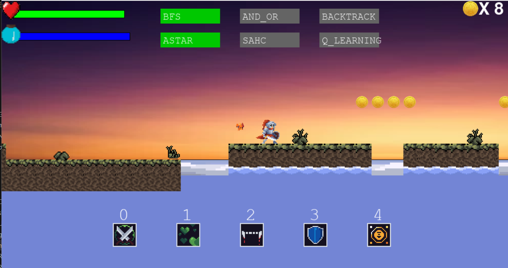
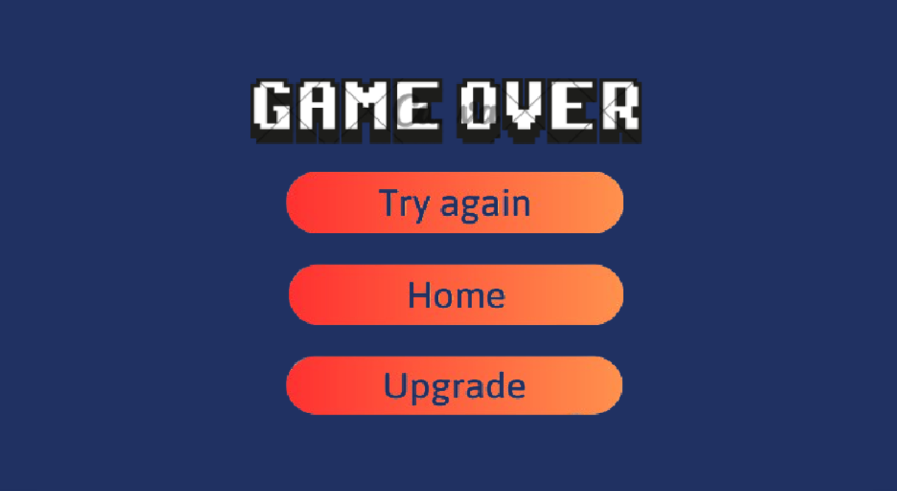
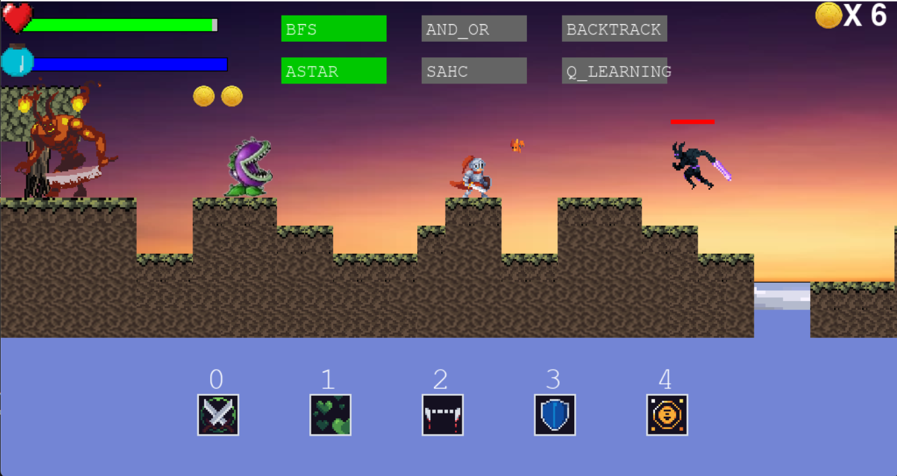
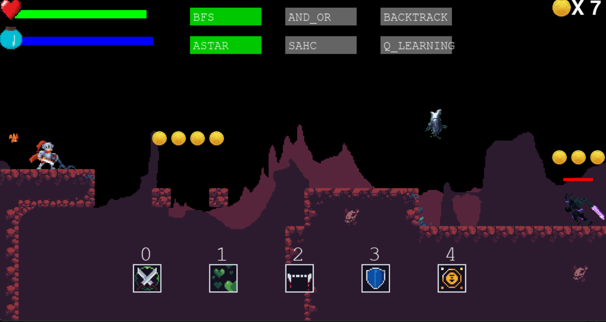
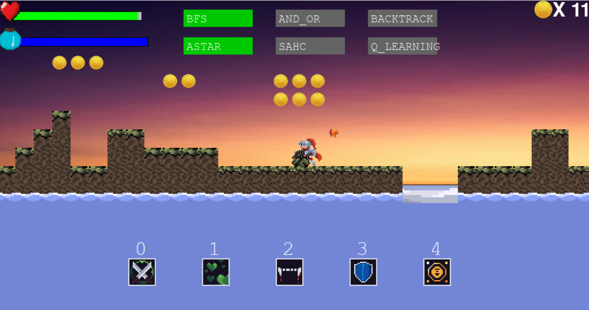

## ĐỒ ÁN AI NHÓM 01
- Mô tả game: Game 2d Platformer sử dụng thư viện pygame của python
- Mục tiêu của game: mô tả các thuật toán tìm đường cho enemy và pet 
## Hướng dẫn sử dụng
# Để run game thì hãy dùng file main.py, sau đó ấn Run thì sẽ vào game
- Di chuyển: di chuyển bằng nút A,W,S,D hoặc 4 nút mũi tên, bấm “SPACE” để nhảy.
- Kỹ năng: người chơi có 5 kỹ năng, sử dụng các phím 0, 1, 2, 3, 4, 5 để sử dụng kỹ năng.
- Các thuật toán tìm đường:
  + Thuật toán tìm đường cho Pet: sử dụng 3 nút ‘BFS’, ‘AND_OR’, ‘BACKTRACK’ để sử dụng các thuật toán tìm đường dành cho thú cưng.
  + Thuật toán tìm đường cho Enemy: sử dụng 3 nút ‘ASTAR’, ‘SAHC’, ‘QLEARNING’ để sử dụng các thuật toán tìm đường dành cho kẻ địch.

# Giao diện nút bấm

# Màn hình Game Over

# Các bản đồ
### Map 0

### Map 1

### Map 2

